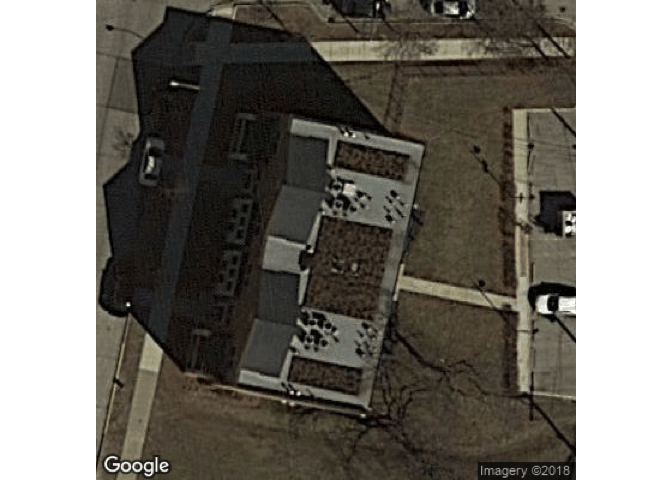
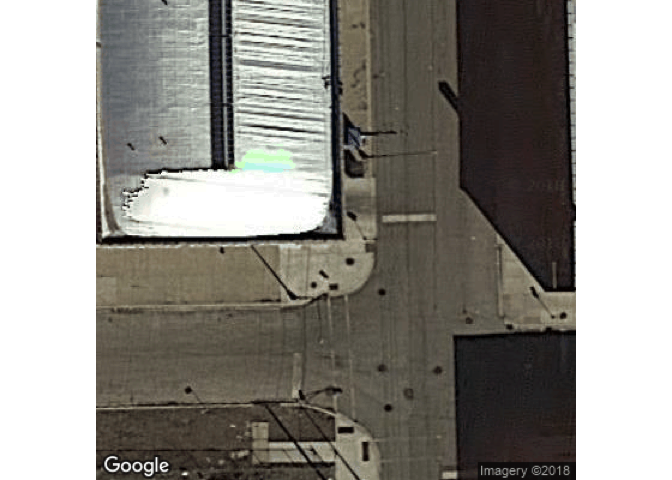

Exploration des données
================
Meetup Machine Learning Québec - Stéphane Caron
29 October 2018

Mise en contexte
================

Pour entraîner votre modèle, vous aurez accès à des données structurées dans 2 formats. Le premier format consiste en un jeu de données plus classique avec une observation par ligne et une variable explicative par colonne (ex. *dataframe* R ou python). Pour le deuxième format, les données sont stockées sous formes d'images classiques, en format *.png*.

Présentation des données
========================

Nous allons commencer par importer les jeux de données.

``` r
library(data.table)
data_train_features <- fread("data/train-features.csv")
data_train_reponses <- fread("data/data-id-train.csv")
```

On peut commencer par sortir le nombre de toits verts que nous avons dans notre jeu de données d'entraînement.

``` r
(table_toits_vert <- table(data_train_reponses$green_roof_ind))
```

    ## 
    ##    0    1 
    ## 1400  400

On remarque que nous avons une proportion d'environ 22 % de toits verts dans notre jeu de données. Il s'agit donc d'une situation où les données ne sont pas parfaitement balancées entre les deux classes (50/50). Cependant, il ne s'agit pas d'un cas extrême de données débalancées. C'est un aspect que vous devrez garder en tête lors de la préparation de votre modèle.

Chaque jeu de données comporte un identifiant unique. Vous pouvez en tout temps retrouver l'image correspondante en utilisant l'*ID* présent dans le nom du fichier. Par exemple, on peut retrouver une image de chacune des classes dans le jeu de données *data-train-id.csv* et voir les images étant rattachées à celles-ci. Voici un exemple de toit vert:

``` r
library(png)
set.seed(666)

exemple_toit_vert <- data_train_reponses[sample(which(data_train_reponses$green_roof_ind == 1), 1),]$ID
grid::grid.raster(readPNG(paste0("data/data-train-folder/data-train/image-", exemple_toit_vert, ".png")))
```



``` r
exemple_toit_normal <- data_train_reponses[sample(which(data_train_reponses$green_roof_ind == 0), 1),]$ID
grid::grid.raster(readPNG(paste0("data/data-train-folder/data-train/image-", exemple_toit_normal, ".png")))
```



On remarque que les toits verts sont reconnus par leur couleur "brunâtre" et leur texture particulière. Vous pouvez consulter d'autres exemples pour bien comprendre ce que vous devez modéliser.

Données avec *features*
-----------------------

Comme mentionné en introduction, vous aurez accès à un jeu de données (*train-features.csv*) où chaque image est représentée par un vecteur de nombre réels qui correspondent aux poids de la dernière couche du réseau de neurones `ResNet50` entraîné sur le jeu de données `imagenet`. Pour plus de détails sur la méthodologie utilisée pour trouver ces représentations, cliquez sur ce [lien](https://github.com/stecaron/meetup-ML-assurance-hackathon/wiki).

Données stockées sous forme d'images
------------------------------------

Vous aurez également accès à un fichier (*data-train.zip*) contenant toutes les images originales. Vous pourrez utiliser ces images pour analyser les résultats de votre modèle, mais également pour entraîner directement votre modèle. Les images sont stockées dans un format de 224x224.

Exploration des données
=======================

L'exploration des données sera faite exclusivement sur le jeu de données plus "classiques" avec les *features* pré-calculées, tel que défini dans le premier format de la mise en contexte.

Informations générales
----------------------

Comme mentionné plus haut, la proportion de toits verts est d’environ 22 %. Voici quelques informations générales sur le jeu de données avec les *features* :

``` r
dim(data_train_features)
```

    ## [1] 1800 2049

``` r
str(data_train_features, list.len = 8)
```

    ## Classes 'data.table' and 'data.frame':   1800 obs. of  2049 variables:
    ##  $ ID   : int  519 1594 1580 243 525 531 257 1231 1557 1543 ...
    ##  $ V1   : num  0 0.2064 0.0169 0 0.052 ...
    ##  $ V2   : num  1.0173 0.0743 0.0466 0.3934 0.3531 ...
    ##  $ V3   : num  0.0375 0 0.6051 0 0.109 ...
    ##  $ V4   : num  0.882 0.39 0.142 0.127 0.163 ...
    ##  $ V5   : num  0.1202 0.00332 0.01454 0.02275 0.03517 ...
    ##  $ V6   : num  0.00338 0.25047 0.03976 0 0.025 ...
    ##  $ V7   : num  4.3122 0.0589 0.9601 2.1706 0.9007 ...
    ##   [list output truncated]
    ##  - attr(*, ".internal.selfref")=<externalptr>

Réduction de dimensionnalité
----------------------------

Comme vous pouvez le remarquer, le jeu de données *train-features.csv* a plus de colonnes (variables) que de lignes (observations). Cela fait notamment en sorte que le problème d'optimisation pour une régression classique aura une infinité de solutions. On ne pourrait donc pas appliquer par exemple un *GLM* directement sur le jeu de données. En conclusion, étant donné que le jeu de données initial possède 2048 variables explicatives (si on enlève le *ID*), il devrait être pertinent de considérer une méthode de **réduction de la dimensionnalité** et ainsi représenter les données dans un espace à plus petite dimension ...
